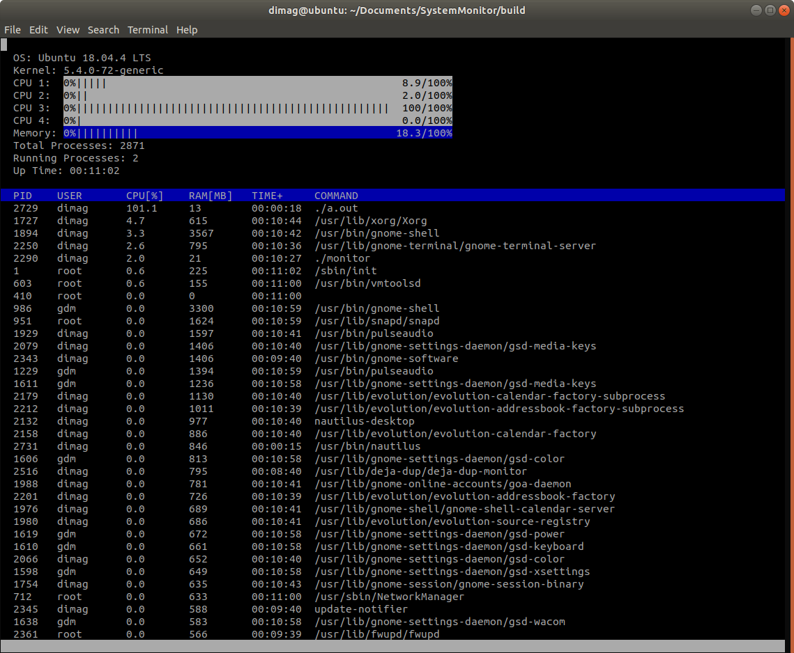

# System Monitor

This is System Monitor Project from the Object Oriented Programming Course of the [Udacity C++ Nanodegree Program](https://www.udacity.com/course/c-plus-plus-nanodegree--nd213)

## ncurses
[ncurses](https://www.gnu.org/software/ncurses/) is a library that facilitates text-based graphical output in the terminal. This project relies on ncurses for display output.
Install ncurses on Linux environment as follows: `sudo apt install libncurses5-dev libncursesw5-dev`

## Make
This project uses [Make](https://www.gnu.org/software/make/). The Makefile has four targets:
* `build` compiles the source code and generates an executable
* `format` applies [ClangFormat](https://clang.llvm.org/docs/ClangFormat.html) to style the source code
* `debug` compiles the source code and generates an executable, including debugging symbols
* `clean` deletes the `build/` directory, including all of the build artifacts

## Instructions
1. Build the project: `make build`
2. Run the resulting executable: `./build/monitor -d <delay deciseconds>`,
   where `<delay deciseconds>` must be replaced with positive integer meaning delay between updates measured in tenths of seconds.
   Note: command line option could be omitted, in which case delay value of `15 deciseconds` would be applied by default.

## Interactive Commands

#### q
    quit the program

#### s
    stop/resume the program

#### r
    recalculate values

#### ArrowUp, ArrowDown, PgUp, PgDn, Home, End
    scroll the processes list

#### p
    sort processes by CPU utilization (from highest to lowest)

#### m
    sort processes by RAM utilization (from highest to lowest)

#### t
    sort processes by uptime (from newest to oldest)

#### i
    invert the sort order

#### k
    show/hide kernel threads

